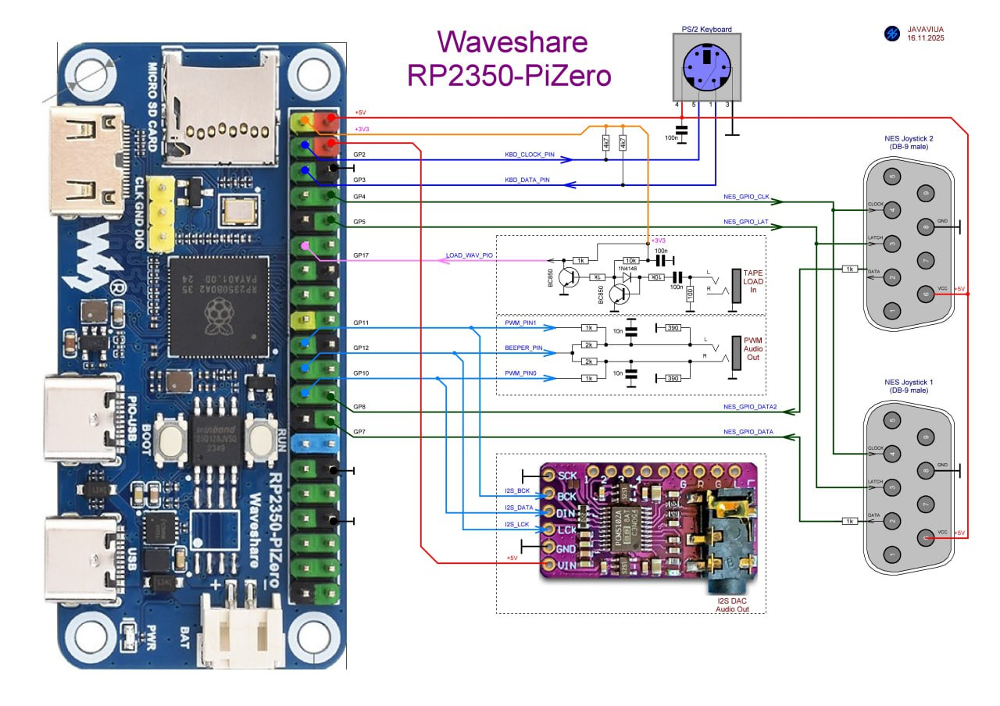
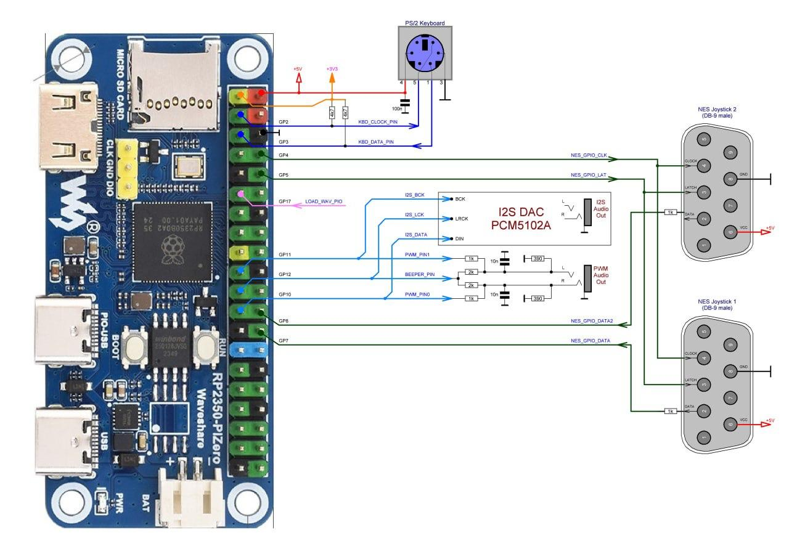
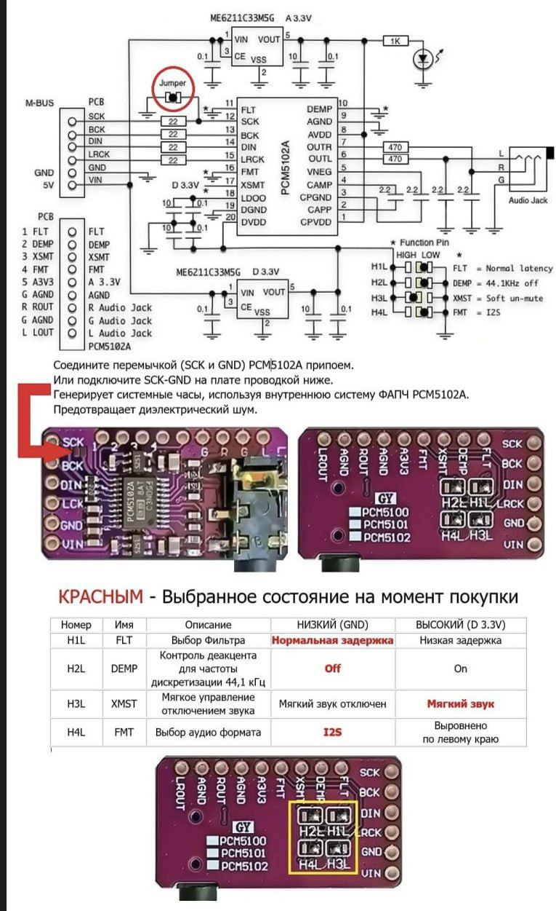

# Подготовка рабочего места: Waveshare RP2350-PiZero

Статус: рабочая инструкция, редакция 0.3 (2026-10-07). Эталонное место собрано и проверено с pico-launcher, MOS2 (звук не подтверждён, см. раздел 4), murm386, PICO-BK и pico-speccy. Код платы в именах прошивок и в матрице совместимости — `z0p2` ([`../COMPATIBILITY.md`](../COMPATIBILITY.md)).

> **Это не основная плата класса.** Основная — Olimex RP2040-PICO-PC + Pico 2 (README класса, п. 1.7.2). У RP2350-PiZero нет своего звукового выхода, поэтому каждое рабочее место требует **дополнительного оборудования** — внешнего звукового модуля (раздел 1), который подключается проводами к контактам платы. Это дороже, дольше в подготовке и даёт ещё одно место для неисправностей. Плату имеет смысл выбирать, если Olimex недоступен (например, при ограниченной доставке из Европы) или такие платы уже есть. Кроме того, в README класса (п. 1.7.2) отмечены замечания к качеству исполнения отдельных экземпляров — платы перед установкой на места проверяются поштучно (раздел 5.3).

## 1. Комплектация одного рабочего места

| Компонент | Количество | Примечание |
|---|---:|---|
| Waveshare RP2350-PiZero | 1 | Микроконтроллер RP2350B, 16 МБ Flash, слот microSD, выход mini-HDMI, два разъёма USB Type-C (основной USB и PIO-USB), кнопки BOOT и RUN. PSRAM по умолчанию не установлена — на плате есть место под микросхему; вариант с PSRAM брать по возможности (README класса, п. 1.7.7) |
| Звуковой модуль I2S на ЦАП PCM5102A | 1 | **Обязательное дополнительное оборудование**: звук на занятиях обязателен (README класса, п. 1.7.4), а своего выхода у платы нет. Выбран I2S, а не ШИМ (PWM) и не звук по HDMI: его поддерживает большинство прошивок комплекта и он не отнимает у эмулятора процессорное время. Подключение — раздел 2.1 |
| Провода Dupont «мама — мама» | 5 | Dupont Jumper Cable Female to Female — продаются наборами, часто с пометкой «для Arduino DIY»; длина 10–20 см. Простейший способ подключить звуковой модуль без пайки (раздел 2.1) |
| Монитор HDMI и кабель mini-HDMI → HDMI | 1 | Обязательна поддержка режима 640×480 при 60 Гц; для эмулятора БК (PICO-BK) по умолчанию нужен режим 720×576 при 50 Гц (CEA 576p), при отборе плат (раздел 5.3) — также 800×600 при 60 Гц. Однорежимные кассовые мониторы, не поддерживающие 640×480 при 60 Гц, не подходят |
| USB-клавиатура HID, 101+ клавиша | 1 | Полноразмерная, с NumPad. Подключается к разъёму USB Type-C без пометки PIO-USB (если в имени прошивки не указано обратное) через OTG-переходник USB Type-C (штекер) → USB-A (гнездо); подробнее — раздел 2, п. 8 |
| microSD-карта | 1 | Форматирование FAT32 с размером кластера 4 КБ (раздел 3); требуется проверка совместимости с протоколом SPI (чаще всего это карты объёмом до 32 ГБ) |
| Наушники | 1 | Подключаются к гнезду звукового модуля; на местах преподавателя и демонстрации — активные колонки |
| Питание | комплект | Блок питания 5 В с кабелем USB Type-C — во второй разъём, с пометкой PIO-USB: это штатный способ питания, когда основной разъём занят клавиатурой; хаб не нужен (раздел 2, п. 9). Блок питания желательно проверить заранее, чтобы избежать проблем с уровнем пульсаций |
| Подложка под плату | 1 | Коврик для мыши или кусок мягкого материала: плата без корпуса, подложка защищает её контакты и стол (README класса, п. 1.7.8) |

Внешняя PSRAM, PS/2-клавиатура, USB-мышь и геймпады NES — опции, не необходимые для базового рабочего места.

## 2. Аппаратная подготовка

1. Осмотреть плату: пайку разъёмов mini-HDMI, Type-C и слота microSD, гребёнку контактов, отсутствие механических повреждений. Плата перед установкой на место учащегося проходит отбор по разделу 5.3: микроконтроллер здесь впаян, поэтому отбирается плата целиком.
2. Положить плату на мягкую подложку (коврик для мыши): корпуса нет, а при нажатии BOOT и RUN выводы обратной стороны не должны вдавливаться в стол (README класса, п. 1.7.8).
3. При отключённом питании подключить звуковой модуль по разделу 2.1.
4. Подключить HDMI-монитор кабелем mini-HDMI → HDMI. **Убавить громкость встроенных динамиков монитора до нуля** (см. примечание о звуке через HDMI ниже).
5. Подключить наушники к гнезду звукового модуля. Для преподавательского и демонстрационного места — активные колонки.
6. Подготовить microSD по разделу 3 и установить её в слот платы.
7. Установить менеджер прошивок по разделу 4.
8. Подключить USB-клавиатуру к разъёму USB Type-C без пометки PIO-USB (если в имени прошивки не указано обратное) через OTG-переходник Type-C → USB-A. Подбор переходника требует проверки с конкретным экземпляром платы и клавиатуры.
9. Подключить блок питания 5 В ко второму разъёму Type-C — с пометкой PIO-USB. Это штатный способ питания платы, когда основной разъём занят клавиатурой; хаб не нужен. Первое включение — после завершения всех соединений.

**Разъём PIO-USB как второй USB-хост — опция.** Прошивки с `PIOUSB` в имени (сейчас это одна сборка pico-speccy) умеют работать с USB-устройствами и через этот разъём — например, клавиатура и геймпад без хаба. Остальные прошивки комплекта его не опрашивают; дорабатывать их отложено.

**Звук через HDMI.** MOS2 выводит звук только в звуковой модуль, но некоторые прошивки (PICO-BK, pico-speccy) передают звук и по HDMI. Если на мониторах оставлена громкость, запуск такой прошивки на нескольких местах сразу даст какофонию на весь класс. Поэтому громкость динамиков мониторов выставляется в ноль при подготовке места и проверяется перед занятием; звук у учащегося — только в наушниках. Выводит ли прошивка звук в HDMI, указано в [`../COMPATIBILITY.md`](../COMPATIBILITY.md).

### 2.1. Подключение звукового модуля

Простейший способ — **пять проводов Dupont «мама — мама»** (Dupont Jumper Cable Female to Female, «для Arduino DIY»): они надеваются прямо на штыри гребёнки платы и на штыри модуля, паять ничего не нужно. Разводка — как на схеме ниже (она же — профиль платы `BOARD_Z2` у murm386):

| Вывод модуля PCM5102A | Куда на RP2350-PiZero |
|---|---|
| BCK | GP11 |
| DIN | GP10 |
| LCK (LRCK) | GP12 |
| GND | GND |
| VIN | +5V |
| SCK | на GND **на самом модуле** — перемычкой припоем между контактами SCK и GND (на схеме ниже обведена красным); если паять нельзя, — шестым проводом к GND |

На схеме показано всё, что можно подключить к плате; для рабочего места класса нужен только модуль I2S внизу (I2S DAC Audio Out). Звук через I2S и через PWM (блок PWM Audio Out) — взаимоисключающие варианты: они занимают одни и те же выводы GP10–GP12, одновременно подключается только один. Клавиатура PS/2, геймпады NES и вход магнитофона — по желанию.

Та же разводка в другом виде, с модулем I2S в виде блока:

**Настройка модуля PCM5102A.** На обратной стороне модуля — перемычки H1L–H4L; в заводском состоянии они обычно уже выставлены как нужно (FLT — нормальная задержка, DEMP — выкл., XSMT — звук включён, FMT — I2S). Проверить по картинке и запаять перемычку SCK–GND:

Те же выводы GP10 (DIN), GP11 (BCK), GP12 (LRCK) используют все прошивки комплекта для z0p2, которые выводят звук через I2S: MOS2, murm386, PICO-BK, pico-nes и pico-speccy. Модуль подключается один раз и не перекоммутируется при смене прошивки.

## 3. Подготовка SD-карты

1. Сохранить нужные данные с карты: форматирование удалит существующее содержимое.
2. Создать раздел с файловой системой **FAT32 с размером кластера 4 КБ** (4096 байт). С другим размером кластера возможны проблемы в FreeDOS, которую загружает murm386. Заводское форматирование и программа SD Card Formatter для карт 16–32 ГБ обычно ставят кластер 32 КБ, поэтому карту нужно отформатировать самостоятельно:
   - Windows: `format X: /FS:FAT32 /A:4096 /Q` (X — буква карты) или в окне «Форматирование» выбрать FAT32 и «Размер единицы распределения» 4096 байт;
   - Linux: `sudo mkfs.vfat -F 32 -s 8 -S 512 /dev/sdX1`;
   - macOS: `sudo newfs_msdos -F 32 -c 8 /dev/diskXs1` (предварительно `diskutil unmountDisk`).
3. Скопировать файлы на карту в два шага — порядок важен:
   1. **содержимое** общего каталога [`sdcard/`](../../sdcard/) из корня репозитория — в корень карты. Это общая для всех плат часть: `/mos2` (MOS2 с приложениями и `config.sys`), `/freedos` с играми и учебными программами для murm386, `/ZX` с программами и играми для pico-speccy, `/test` с файлами для приёмки рабочего места (раздел 5) и каталоги для других эмуляторов. Состав описан в [`../../SDCARD.md`](../../SDCARD.md);
   2. затем **содержимое** каталога этой платы [`sdcard/`](sdcard/) (`hardware/waveshare-rp2350-pizero/sdcard`) — поверх, в корень той же карты. Здесь эмуляторы, собранные для `z0p2` (`/emu`); при совпадении имён файлы платы заменяют общие. Состав — в [`MANIFEST.md`](MANIFEST.md).
4. Прошивки добавлять только собранные именно для **z0p2**. Сборки для других плат (например, с префиксом `PCp2-`) здесь не работают: у них другие выводы видео, SD-карты и звука. MOS2 распознаёт прошивки своей платы по расширению `.z0p2` (чувствительно к регистру); оба менеджера запускают и обычные `.uf2`. Прошивки учебного комплекта рекомендуется называть с префиксом `z0p2-`, как в каталоге `sdcard/emu`, чтобы по имени было видно, для какой платы они собраны.
5. Учебные программы, данные и игры размещать в отдельных каталогах. Состав учебного комплекта и статус проверки прошивок — в [`../COMPATIBILITY.md`](../COMPATIBILITY.md).
6. Целостность эталонного комплекта перед изготовлением копий проверяется по двум файлам: [`SHA256SUMS`](../../SHA256SUMS) в корне репозитория — общая часть (см. `SDCARD.md`, раздел 22), и [`SHA256SUMS`](SHA256SUMS) в каталоге платы — UF2 и файлы платы (см. `MANIFEST.md`, раздел 3).

Одна и та же карта может служить на платах разных типов, если на ней лежат эмуляторы для каждой: файлы различаются префиксами, а murm386 хранит настройки для каждой платы отдельно (для этой — в `/.config/386/Z2/`).

## 4. Установка менеджера прошивок

На плату устанавливается один из двух менеджеров:

- **pico-launcher — основной вариант** для начального уровня: [`pico-launcher/z0p2-uf2-launcher-HDMI-HID.uf2`](pico-launcher/). Файловый браузер SD-карты со справкой (F1), просмотром (F3) и простым редактором (F4) текстовых файлов; запускает прошивки учебного комплекта. Приёмка — раздел 5.1.
- **MOS2 (murmulator-os2) — расширенный вариант** для занятий с командной строкой, файловой системой и BASIC: [`murmulator-os2/z0p2-murmulator-os-VGA-HDMI-HID-2.3.2-252MHz-8.uf2`](murmulator-os2/). Загружается и работает, но **правильная работа звука не подтверждена**: при проверке стереофайл `snd_lr.wav` звучал, а моно `snd_mono.wav` и `blimp` молчали. Вероятная причина — отходивший контакт в регуляторе громкости на шнуре наушников; нужна повторная проверка (см. [`../COMPATIBILITY.md`](../COMPATIBILITY.md)). Пока звук в MOS2 не подтверждён, на места учащихся ставится pico-launcher. Приёмка — раздел 5.2.

Версии, исходники и контрольные суммы — в [`MANIFEST.md`](MANIFEST.md).

Первоначальная установка — через штатный загрузчик RP2350 (режим BOOTSEL). Кнопки на плате называются **BOOT** и **RUN**:

1. При отключённом USB удерживать кнопку **BOOT**.
2. Подключить плату к компьютеру кабелем USB Type-C через разъём **без** пометки PIO-USB.
3. Отпустить BOOT после появления USB-накопителя загрузчика.
4. Скопировать на накопитель UF2-файл менеджера.

Повторное подключение для входа в загрузчик не требуется: удерживая BOOT, кратко нажать RUN, затем отпустить BOOT.

В pico-launcher и MOS2 удержание **F11** при включении или перезагрузке предотвращает автоматический запуск выбранной ранее прошивки и открывает файловый менеджер, в котором можно выбрать целевую прошивку — например, игру или эмулятор.

**Если что-то не загружается** (чёрный экран, сразу запускается не та прошивка, менеджер «гаснет» при вставленной SD-карте), порядок действий такой:

1. Включить или перезагрузить плату, удерживая **F11**.
2. Если и с F11 не загружается — вынуть SD-карту, на компьютере удалить с неё файл `/.firmware` и вставить карту обратно. Этот файл-метка остаётся на карте после запуска прошивки из менеджера и заставляет плату снова уходить в ту прошивку; удаление ничего не портит — менеджер создаст его заново при следующем выборе прошивки.

Обычный способ перезагрузки — **Ctrl+Alt+Del**: его поддерживают pico-launcher, MOS2 и почти все прошивки комплекта (для прошивок, который этого делать не умеют, или делают что-то другое, обычно есть пометка в соответствующем учебном модуле). Кнопка RUN и отключение питания нужны только если прошивка зависла, не реагирует на клавиатуру, или на **Ctrl+Alt+Del**.

## 5. Приёмка рабочего места

Приёмка проводится для того менеджера, который установлен на место: 5.1 — pico-launcher (основной вариант), 5.2 — MOS2. Общие предусловия: карта подготовлена по разделу 3, менеджер установлен по разделу 4, на время проверки звука наушники не надеты плотно — сначала убедиться, что громкость умеренная.

Если звука нет или он пропадает, сначала исключить наушники: послушать их на другом источнике (телефоне), пошевелить штекер и регулятор громкости на шнуре. Затем проверить пять проводов модуля и перемычку SCK–GND (раздел 2.1) — провод, соскочивший со штыря, встречается чаще, чем ошибка в прошивке. Если менеджер не загружается — действовать по порядку из раздела 4 («Если что-то не загружается»).

### 5.1. Рабочее место с pico-launcher

| № | Проверка | Действия | Ожидаемый результат |
|---:|---|---|---|
| 1 | Загрузка | Включить питание; если ранее была выбрана прошивка — удерживать **F11** | Браузер файлов SD-карты, видны каталоги `/mos2` и `/test`, сообщения об ошибке SD нет |
| 2 | Видео | Осмотреть экран | Изображение устойчивое, без срывов и мерцания, текст не обрезан по краям |
| 3 | Навигация | Стрелки, PgUp/PgDn, Home/End; Enter на каталоге `/test` | Выделение перемещается; каталог открывается |
| 4 | Справка | **F1**, затем Esc | Открывается и закрывается окно справки |
| 5 | Просмотр | На `/test/edit.txt` — **F3**, стрелки, затем **F10** | Текст файла виден и прокручивается; F10 возвращает в браузер |
| 6 | Редактор, клавиатура и запись на SD | На `/test/edit.txt` — **F4**; набрать буквы, цифры, цифры на NumPad (с NumLock), Enter, Backspace; Ins; **F2**; Esc; затем снова F3 | Все набранные символы появляются; Ins переключает INS/OVR; после F2 и выхода в просмотре видны сохранённые изменения |
| 7 | Удаление с отменой | На `/test/edit.txt` — **F8**, затем Esc | Появляется запрос подтверждения; после Esc файл на месте |
| 8 | Запуск прошивки | Enter на прошивке из `/emu` (например, `z0p2-bk-…`); затем **Ctrl+Alt+Del** с удержанием **F11** | Прошивка запускается и перезагружается по Ctrl+Alt+Del; с F11 — снова браузер |
| 9 | Звук | Запустить прошивку с подтверждённым на этой плате звуком: murm386 (`/emu/z0p2-386-RUNTIME-…`), PICO-BK (`/emu/z0p2-bk-…`) или pico-speccy (`/emu/z0p2-speccy-…`) | Звук в наушниках, подключённых к звуковому модулю. Сам launcher звук не выводит |

Launcher не использует F5–F7, F9 и F12. F5–F7 проверяются в `mc` при приёмке MOS2 (5.2), остальные — в прошивках, которые их задействуют.

### 5.2. Рабочее место с MOS2

Команды вводятся в консоли MOS2: в `mc` консоль открывается и скрывается по **Ctrl+O**.

| № | Проверка | Действия | Ожидаемый результат |
|---:|---|---|---|
| 1 | Загрузка | Включить питание | Через несколько секунд на мониторе `mc` (Murmulator Commander), сообщений об ошибке SD нет |
| 2 | Процессор и память | `cpu`, затем `mem` | Частота 252 МГц; сведения о памяти выводятся без ошибок |
| 3 | Видео | `mode 0`, `mode 1`, `mode 2`, затем `gmode 2`, затем `mode 0` | В каждом режиме изображение устойчивое, без срывов и мерцания, монитор не пишет «нет сигнала». `gmode 2` выводит цветную тестовую таблицу («матрац») и сообщает графическое разрешение драйвера — записать его. Возвращаться — в `mode 0`: на HDMI в `mode 1` шрифт отображается с ошибками (известная недоработка MOS2, приёмку не проваливает) |
| 4 | Клавиатура | `basic /test/kbdtest.bas`, нажимать клавиши по одной; выход — Ctrl+C | Буквы и цифры выводят свой код и символ; Enter, Esc и NumPad (с включённым NumLock) выводят код. Ctrl+Shift переключает раскладку. F-клавиши BASIC не получает — они проверяются в п. 4а |
| 4а | F-клавиши | В `mc` на файле `/test/edit.txt`: **F1**, **F3**, **F4** — каждое окно закрыть Esc; **F5**, **F6**, **F7**, **F8** — в каждом запросе отменить Esc | Каждая клавиша открывает своё окно или запрос; после отмены файлы и каталоги без изменений. F2, F9, F11, F12 в `mc` не задействованы; F11 проверяется в п. 8 |
| 5 | SD: чтение и запись | `ls /`, `cp /mos2/config.sys /tmp/t.txt`, `type /tmp/t.txt`, `rm /tmp/t.txt` | Каталоги `/mos2` и `/test` видны; копия создаётся, выводится содержимое `config.sys`, файл удаляется |
| 6 | Звук, моно | `wav /test/snd_mono.wav` | Выводятся параметры файла (8000 Hz, 1 канал); три сигнала с повышением тона, в обоих ушах, без треска. Если после окончания воспроизведения MOS2 не отвечает — сбросить плату |
| 7 | Звук, каналы | `wav /test/snd_lr.wav` | Низкий сигнал только слева, средний только справа, высокий в обоих. Если каналы перепутаны — записать в примечание к `COMPATIBILITY.md` |
| 7а | Звук, щелчки | В пустой командной строке нажать **Esc** или **Backspace** | Короткие щелчки в наушниках (команда `blimp`) |
| 8 | Переключение прошивок | В `mc` выбрать прошивку из `/emu`, Enter; затем **Ctrl+Alt+Del** с удержанием **F11** | Прошивка запускается и перезагружается по Ctrl+Alt+Del; с F11 — снова MOS2 |
| 9 | Перезагрузка | Ctrl+Alt+Del | MOS2 загружается заново, как в п. 1 |

Пока правильная работа звука в MOS2 на этой плате не подтверждена (раздел 4), результат п. 6–7а записывается в [`../COMPATIBILITY.md`](../COMPATIBILITY.md) и приёмку места не проваливает — на такое место ставится pico-launcher.

### 5.3. Отбор плат по разгону

Большинство эмуляторов комплекта работают с разгоном ядра RP2350 и повышенным напряжением (см. колонку «Частота / напряжение» в [`../COMPATIBILITY.md`](../COMPATIBILITY.md)). Экземпляры RP2350 отличаются по разгонному потенциалу, поэтому каждая плата проверяется до установки на рабочее место. Микроконтроллер RP2350B впаян, поэтому отбирается **плата целиком**. Проверка выполняется на собранном рабочем месте с SD-картой из раздела 3.

**Порог отбора** задаётся самой требовательной прошивкой комплекта — максимальными значениями в колонке «Частота / напряжение» матрицы совместимости. Сейчас это murm386: 504 МГц / 1.6 В. С добавлением прошивок порог может вырасти; тогда последний этап проверки выполняется на новых значениях, а ранее отобранные платы проверяются повторно.

**Длительность этапа.** Ориентир — не меньше 10 минут работы без сбоев. Партию удобно проверять по кругу: запустить этап на всех местах по очереди и вернуться к первому — если за это время плата не зависла и не дала артефактов, этап пройден.

| № | Прошивка | Режим | Действия | Критерий |
|---:|---|---|---|---|
| 1 | PICO-BK | 720×576, 270 МГц / 1.3 В | Запустить `/emu/z0p2-bk-…uf2` | Устойчивое изображение, звук в наушниках |
| 2 | PICO-BK | 800×600, 400 МГц / 1.5 В | Home → пункт HDMI → пробел; запустить игру со встроенной дискеты (Tab, стрелки, Enter) и оставить работать | Нет зависаний, сбросов, артефактов изображения и звука |
| 3 | murm386 | порог отбора, сейчас 504 МГц / 1.6 В (меню Win+F11) | Запустить `/emu/z0p2-386-RUNTIME-…uf2`*, дождаться Volkov Commander; запустить `\FREEDOS\SI.EXE`; оставить работать | FreeDOS загружается, SI выводит индекс производительности, система не зависает |

\* если на плате установлена PSRAM, имеет смысл выбирать прошивки из папки `/emu/psram`: они адаптированы к PSRAM и быстрее универсальной сборки. Из эмуляторов 286/386 наилучшую производительность показывает вариант 286 — его эмулятор «легче».

На эталонной плате проверены режимы 400 МГц (PICO-BK) и 504 МГц / 1.6 В (murm386). Режим PICO-BK 1024×768 / 512 МГц на этой плате не проверялся и в отбор не входит — частоту выше порога проверяет п. 3. После проверки вернуть в PICO-BK видеорежим 720×576 (Home → HDMI), чтобы карта и плата были в исходном состоянии.

Плата относится к классу по максимальному пройденному режиму:

| Класс | Пройдено | Пригодна для |
|---|---|---|
| A | п. 1–3 на пороге отбора | всех прошивок комплекта |
| B | п. 1–2 | прошивок до 400 МГц / 1.5 В: pico-launcher, MOS2, PICO-BK, pico-speccy |
| C | п. 1 | pico-launcher, MOS2 и прошивок до 270 МГц |

На места учащихся устанавливаются платы класса A. Платы классов B и C маркируются и используются как запасные для лёгких задач или на месте преподавателя.

Работа с разгоном и напряжением выше штатного выполняется вне гарантированных производителем режимов и может со временем снижать устойчивость чипа. Проверку п. 2–3 повторяют раз в учебную четверть и при появлении необъяснимых зависаний на рабочем месте.

Результат приёмки записывается в [`../COMPATIBILITY.md`](../COMPATIBILITY.md): дата, экземпляр платы, пройденные пункты, замечания, класс платы по разделу 5.3.

## 6. Тиражирование на весь класс

После успешной приёмки эталонного места зафиксировать версии менеджера и прошивок, состав SD-карты, настройки и результаты тестов. С эталонной SD-карты изготовить копии для остальных мест; проверить запуск и звук на каждом экземпляре. Не считать проверку одного образца доказательством исправности всей партии оборудования.

Запасной узел на этой плате — **плата целиком** с уже установленным менеджером: если повреждена прошивка pico-launcher или MOS2, быстрее заменить плату на занятии, чем перепрошивать её, а восстановлением заняться в менее напряжённое время. Звуковые модули, провода Dupont и OTG-переходники тоже держать с запасом: на рабочем месте без корпуса это самые частые места поломок.

Быть готовым к тому, что дети испортят данные на SD-карте: желательно иметь заранее подготовленные резервные карты для быстрой замены без задержки учебного процесса.

## Файлы каталога

| Путь | Что здесь |
|---|---|
| [`MANIFEST.md`](MANIFEST.md) | что лежит в каталоге платы, из каких исходников собрано, контрольные суммы |
| [`SHA256SUMS`](SHA256SUMS) | контрольные суммы файлов платы (проверка — [`MANIFEST.md`](MANIFEST.md), раздел 3) |
| [`pico-launcher/`](pico-launcher/) | сборка pico-launcher для `z0p2` |
| [`murmulator-os2/`](murmulator-os2/) | сборка MOS2 для `z0p2` |
| [`sdcard/emu/`](sdcard/emu/) | эмуляторы, собранные для `z0p2`: murm386 (три сборки), PICO-BK, pico-nes, pico-speccy (две сборки) |
| [`img/`](img/) | схемы подключения из репозитория MOS2 (раздел 2.1) |

## Источники

- [Waveshare RP2350-PiZero: описание платы](https://www.waveshare.com/wiki/RP2350-PiZero)
- [CNX Software: обзор RP2350-PiZero](https://www.cnx-software.com/?p=153554) — разъёмы USB, кнопки BOOT и RUN, место под PSRAM
- [murm386: профиль платы `BOARD_Z2`](https://github.com/DnCraptor/murm386/blob/main/src/board_config.h)
- [murmulator-os2: схемы подключения (PCM510x, PWM, PS/2, NES)](https://github.com/DnCraptor/murmulator-os2) — картинки в `img/` скопированы оттуда без изменений (`assets/z0p2-pinout.jpg`, `assets/z0p2-pinout2.jpg`, `assets/i2s-dac.jpg`, коммит `aad5813`); проект — GPL v3, автор схем подключения — JAVAVIUA
